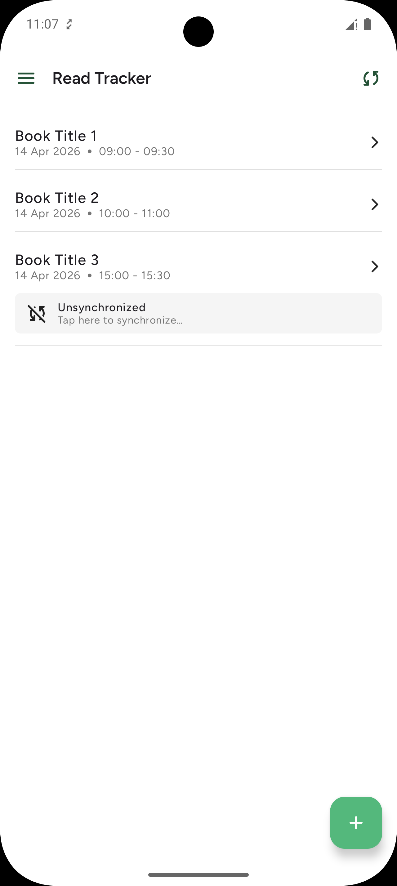
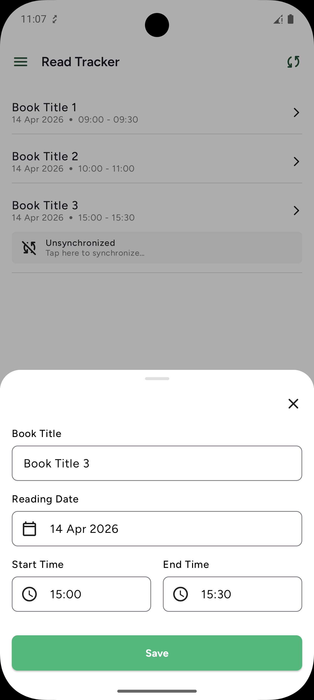

# Track Daily Habits

Modern Android application designed to help users track their reading habits. Built with an **Offline-First** approach, it ensures that your reading progress is always saved locally and synchronized with the cloud when a connection is available.

## 🚀 Features

- **Reading Tracking**: Log your daily reading progress easily.
- **Offline-First**: Full functionality without an active internet connection using local storage.
- **Cloud Sync**: Seamless synchronization with Supabase for data persistence across devices.
- **Modern UI**: Built entirely with Jetpack Compose for a smooth and responsive experience.
- **Secure Auth**: Integrated authentication via Supabase.

## 📸 Screenshots

<p align="center">
  
  
</p>

## 🛠 Tech Stack

- **UI**: [Jetpack Compose](https://developer.android.com/jetpack/compose) (Declarative UI)
- **Navigation**: [Navigation 3](https://developer.android.com/guide/navigation/navigation-3) (Modern Compose-first navigation)
- **Dependency Injection**: [Hilt](https://developer.android.com/training/dependency-injection/hilt-android)
- **Networking**: [Retrofit](https://square.github.io/retrofit/) + [OkHttp](https://square.github.io/okhttp/)
- **Local Database**: [Room](https://developer.android.com/training/data-storage/room)
- **Backend**: [Supabase](https://supabase.com/) (Auth & Database)
- **Asynchronous**: [Kotlin Coroutines](https://kotlinlang.org/docs/coroutines-overview.html) & [Flow](https://kotlinlang.org/docs/flow.html)
- **Serialization**: [Kotlinx Serialization](https://github.com/Kotlin/kotlinx.serialization)
- **Monitoring**: [Firebase Analytics](https://firebase.google.com/docs/analytics), [Timber](https://github.com/JakeWharton/timber), and [Chucker](https://github.com/ChuckerTeam/chucker)

## 🏗 Architecture

The project follows **Clean Architecture** principles, divided into three main layers:
- **Data**: Retrofit services, Room DAOs, and Repository implementations.
- **Domain**: Business logic, Use Cases (if applicable), and Domain models.
- **Presenter**: UI components (Compose) and ViewModels.

## 🛠 Getting Started

### Prerequisites
- Android Studio Ladybug (or newer)
- JDK 17+
- Android SDK 36 (Compile/Target)

### Configuration
The app requires a Supabase instance. Update the `buildConfigField` in `app/build.gradle.kts` if you are using your own backend:
```kotlin
buildConfigField("String", "BASE_URL", "\"YOUR_SUPABASE_URL\"")
buildConfigField("String", "PUBLISHABLE_KEY", "\"YOUR_SUPABASE_KEY\"")
```

### Installation
1. Clone the repository.
2. Open the project in Android Studio.
3. Sync Project with Gradle Files.
4. Run the `app` module on an emulator or physical device.

## 🧪 Testing
- Run Unit Tests: `./gradlew test`
- Run Instrumented Tests: `./gradlew connectedAndroidTest`
